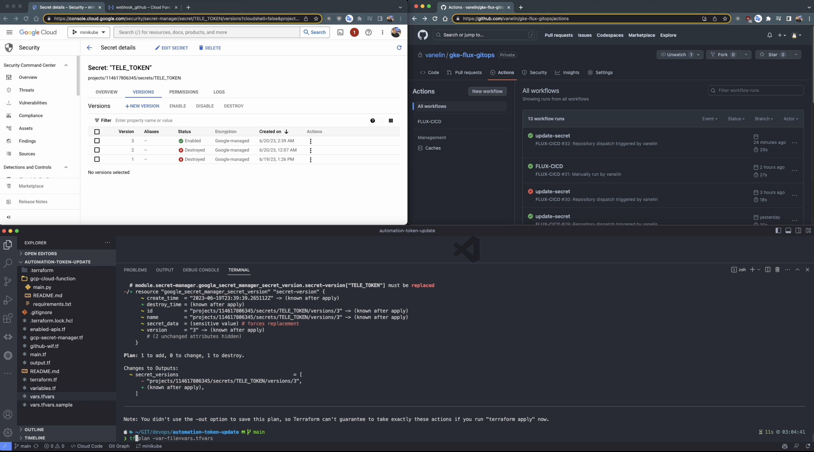

# Setup GCP Workload Identity Federation + GitHub Actions + Secret Manager + Terraform.
DLS for [tf-gcp-gke-cluster-flux](https://github.com/vanelin/tf-gcp-gke-cluster-flux) repository!

We’ll create the following resources by terraform:

1. Enable GCP apis (enabled-apis.tf)
2. Set up Service Account with workload identity provider for GitHub Actions (main.tf)
3. Add secrets to GitHub reposotory from output (github-wif.tf)
4. Set up GCP Secret Manager, add telegram token, push events to Pub/Sub (gcp-secret-manager.tf)
5. Set Up Pub/Sub (gcp-secret-manager.tf)

Development stage, it can be configured manually for now:

6. Set up GCP Cloud Functions as a trigger for running GitHub Actions (gcp-сloud-function)

## List of useful resources:
- [Google Secret Manager for Terraform](https://github.com/GoogleCloudPlatform/terraform-google-secret-manager)
- [Get secretmanager secrets in GitHub Actions runners](https://github.com/google-github-actions/get-secretmanager-secrets)
- [Mozilla SOPS](https://github.com/mozilla/sops)

### The combination of GCP Workload Identity Federation, GitHub Actions, Secret Manager, and Terraform is aimed at providing a secure and streamlined approach for deploying applications and using resources to Google Cloud Platform (GCP) using GitHub pipelines. Here's how each component plays a role:

- GCP Workload Identity Federation: Workload Identity Federation allows you to authenticate and authorize GitHub Actions pipelines to access GCP resources without the need to store and manage service account keys or credentials in GitHub repositories or runners. It establishes a trust delegation relationship between a GitHub Actions workflow and the permissions on GCP.
- GitHub Actions: GitHub Actions is a powerful tool for automating deployments. By integrating with GCP Workload Identity Federation, GitHub Actions can securely authenticate with GCP and access resources, such as deploying applications or configuring infrastructure.
- Secret Manager: GCP Secret Manager is used to securely store secrets, such as API keys, passwords, or other sensitive information. In this context, Secret Manager can be used to store the necessary credentials or tokens required for authenticating with GCP and GitHub.
- Terraform: Terraform is an infrastructure-as-code tool that allows you to define and manage your infrastructure in a declarative manner. It can be used to automate the provisioning and configuration of GCP resources, including the setup of GCP Workload Identity Federation and other necessary configurations.

### By combining these components, you can achieve the following benefits:

- Enhanced security: The use of GCP Workload Identity Federation eliminates the need to store long-lived service account keys in GitHub repositories or runners, reducing the risk of credential exposure. Instead, short-lived credentials are generated on-demand using OIDC and Workload Identity Federation.
- Simplified authentication: GitHub Actions can authenticate with GCP using the temporary credentials obtained through Workload Identity Federation. This eliminates the need to manually manage and rotate service account keys or other long-lived credentials.
- Secure secret management: Secrets required for authentication or other sensitive information can be stored securely in GCP Secret Manager. This ensures that the secrets are not exposed in GitHub repositories or runners.
- Infrastructure automation: Terraform can be used to automate the provisioning and configuration of GCP resources, including the setup of GCP Workload Identity Federation. This allows for consistent and repeatable infrastructure deployments across different environments.

# Requirements

- [Install the terraform](https://developer.hashicorp.com/terraform/tutorials/aws-get-started/install-cli#install-terraform)

- [Create GitHub token:](https://docs.github.com/en/authentication/keeping-your-account-and-data-secure/managing-your-personal-access-tokens)

For personal access token (classic), or using GitHub token is created for `flux-gitops` repository:
|         | 		   		   |			                          |
| ------: | :----------------- |:------------------------------------ |
| ✅      | `repo`             | Full control of private repositories |
| ✅      | `admin:public_key` | Full control of user public keys     |
|  		  |  		           |	                                  |


- [Install the gcloud CLI](https://cloud.google.com/sdk/docs/install)
  - `gcloud auth login`
  - `gcloud auth application-default login`
- Add all sensitive varibles to `vars.tfvars` file, see `vars.tfvars.sample`.

# Infrastructure deployment to GKE
1. Edit the `vars.tfvars` file, specifying the necessary values in accordance with the configuration
2. Create a Google Storage Bucket:
```bash
$ gcloud storage buckets create gs://385711-bucket-tfstate --project=<PROJECT_ID> --default-storage-class=STANDARD --location=US --uniform-bucket-level-access
```
3. Clone repository
``` bash
$ git clone https://github.com/vanelin/automation-token-update.git
$ cd automation-token-update 
```
4. Deploy
```bash
 $ terraform init
 $ terraform validate
 $ terraform plan -var-file=vars.tfvars
 $ terraform apply -var-file=vars.tfvars

$ terraform state list
github_actions_secret.gcp-project
github_actions_secret.wif-pool
github_actions_secret.wif-sa-email
google_iam_workload_identity_pool.github
google_iam_workload_identity_pool_provider.github
google_project_iam_member.roles["roles/cloudkms.cryptoKeyEncrypter"]
google_project_iam_member.roles["roles/resourcemanager.projectIamAdmin"]
google_project_iam_member.roles["roles/secretmanager.secretAccessor"]
google_project_service.service["cloudresourcemanager.googleapis.com"]
google_project_service.service["iam.googleapis.com"]
google_project_service.service["iamcredentials.googleapis.com"]
google_project_service.service["pubsub.googleapis.com"]
google_project_service.service["secretmanager.googleapis.com"]
google_project_service.service["sts.googleapis.com"]
google_project_service_identity.secretmanager_identity
google_pubsub_topic.secret
google_pubsub_topic_iam_member.sm_sa_publisher
google_service_account.github_actions
google_service_account_iam_member.github_actions
random_id.random_topic_id_suffix
module.secret-manager.google_secret_manager_secret.secrets["TELE_TOKEN"]
module.secret-manager.google_secret_manager_secret_version.secret-version["TELE_TOKEN"]
```
5. [Set up GCP Cloud Functions](gcp-сloud-function/README.md)
6. Create your pipline using the WIF in GitHub Action
7. Change the telegram token simply by adding new token to `vars.tfvars` and running `terraform apply -var-file=vars.tfvars`
8. Destroy all resources:
```bash
$ terraform destroy -var-file=vars.tfvars
```

## Video demonstration:
[](https://share.cleanshot.com/QyhP4svh "Click to watch")